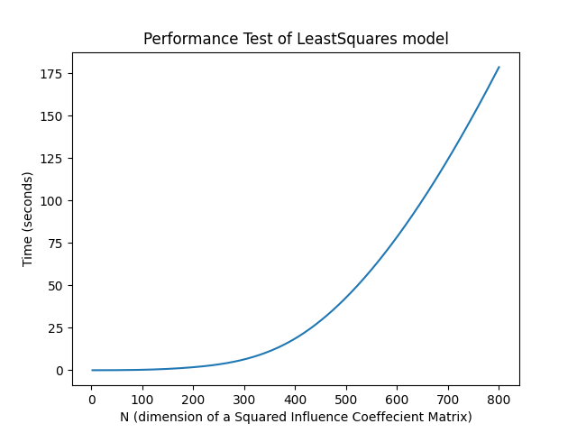

.. _about the author:
About the Author:
-----------------

| Maged M.Eltorkoman
| 1. B.SC in Mechanical engineering 2000, Alexandria University, Egypt.
  2. `Certified ISO-CAT II Vibration
  Analyst. <https://certificates.mobiusinstitute.com/d8973420-d21e-42f8-a7ba-a13f889e035f#gs.kz6fsv>`__
| 3. `Udacity Nanodegree in Advanced Data
  Analysing <https://www.linkedin.com/in/maged-eltorkoman/overlay/1611041255110/single-media-viewer/>`__
  4. `Freelance Data
  Analyst <https://www.upwork.com/freelancers/~010cf5d4f25c9fa689>`__ ##
  Contact: |LinkedIn| |Email|
| Email: newmage@gmail.com

.. |Downloads| image:: https://pepy.tech/badge/hsbalance
.. |License: MIT| image:: https://img.shields.io/badge/License-MIT-yellow.svg
.. |pic1| image:: https://img.shields.io/badge/Python-14354C?&logo=python&logoColor=white
.. |pic2| image:: https://img.shields.io/badge/-Jupyter-white?logo=Jupyter
.. |Generic badge1| image:: https://img.shields.io/badge/Build-Dev-red.svg
.. |Generic badge2| image:: https://img.shields.io/badge/Test-Passing-Green.svg
.. |Binder| image:: https://mybinder.org/badge_logo.svg

.. |“Buy Me A Coffee”| image:: https://www.buymeacoffee.com/assets/img/custom_images/orange_img.png
.. |LinkedIn| image:: https://img.shields.io/badge/LinkedIn-0077B5?style=plastic&logo=linkedin&logoColor=white
.. |Email| image:: https://img.shields.io/badge/Gmail-D14836?style=plastic&logo=gmail&logoColor=white
