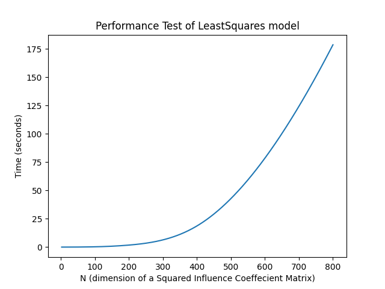

.. _performance test:

Performance Test 
----------------

| The package was tested against injected random
  Influence coefficient matrices :class:`hsbalance.IC_matrix.Alpha` with N x N size. The output
  can be summarized in the following plot. 

.. _performance-test-plot:

|performance_test|

| The graph was a test for the Least Squares model. It shows a good time
  performance of 800 x 800 matrix under 3 minutes.
| The hardware and software for the machine running the test can be
  found `data/test_conditions.txt <https://github.com/MagedMohamedTurk/Turbomachinery-Rotors-Balancing/blob/master/data/test_conditions.txt>`__
| The code below is to generate the previous :ref:`plot <performance-test-plot>`.

::

   import time
   from scipy.interpolate import make_interp_spline
   import numpy as np
   import matplotlib.pyplot as plt
   from hsbalance import Alpha, model, tools

   def test_performance(n):
       '''
       Test the performance of model time_wise.
       Args:
         n : dimension of influence coefficient matrix nxn.
       Output:
         t : time elapsed in the test rounded to 2 decimal.
       '''
       # Generate alpha matrix nxn dimension
       alpha = Alpha()
       real = np.random.uniform(0, 10, [n, n])
       imag = np.random.uniform(0, 10, [n, n])
       alpha.add(real + imag * 1j)
       # Generate initial condition A matrix nx1
       real = np.random.uniform(0, 10, [n, 1])
       imag = np.random.uniform(0, 10, [n, 1])
       A= real + imag * 1j
       # start timing
       start = time.time()
       # building model LeastSquare.
       w =  model.LeastSquares(A, alpha).solve()
       # implement the model to get run time.
       error = tools.residual_vibration(alpha.value, w, A)
       t = time.time() - start
       return round(t, 2)
   performance_time = []
   N = [2, 10, 50, 100, 200, 400, 600, 800]
   for n in N:
       performance_time.append(test_performance(n))
   print(N, performance_time)
   spline = make_interp_spline(N, performance_time)
   x = np.linspace(min(N), max(N), 500)
   y  = spline(x)
   plt.plot(x, y, label="Performace Test")
   plt.xlabel('N (dimension of a Squared Influence Coeffecient Matrix)')
   plt.ylabel('Time (seconds)')
   plt.title('Performance Test of LeastSquares model')
   plt.show()

